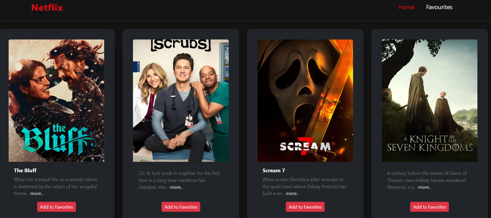
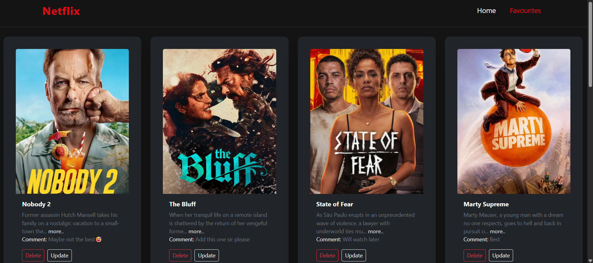
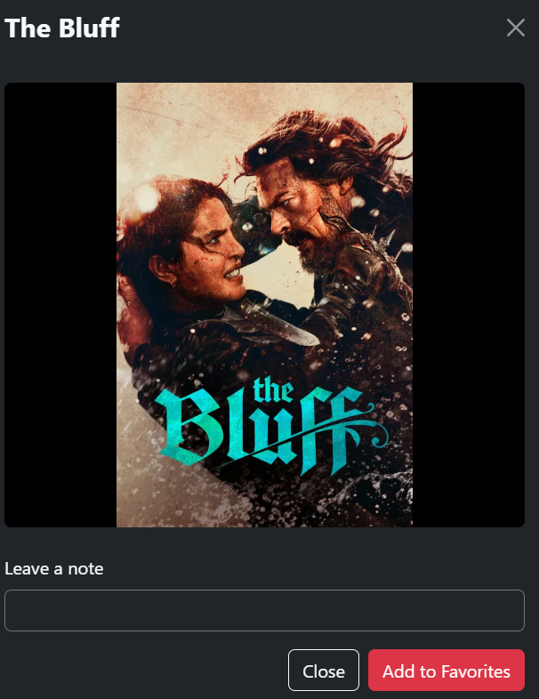

# Netflix Clone 🎬

A **Netflix-inspired web application** where users can:

- View the latest movies
- Add movies to their favorites page
- Leave comments on movies
- Update or delete favorites

👉 **Live Demo:** [Netflix Clone](https://cloneofnetfliix.netlify.app/)

👉 **Backend Repository:** [Movies Library (Node.js/Express.js)](https://github.com/murad-shadeh/Movies-Library)

## 📸 Screenshots

### Home Page



### Favorites Page



### Movie Modal



### Update Modal


## 🚀 Tech Stack

**Frontend:**

- HTML5, CSS, JavaScript (ES6)
- React.js (with VITE)
- React Router
- Context API
- React Bootstrap + Bootstrap Utilities
- Axios
- React Hooks

**Backend:**

- Node.js + Express.js
- REST API

**Deployment & Tools:**

- Netlify (Frontend)
- Render (Backend)
- Git & GitHub
- VS Code
- npm

## ⚡ Features

✔️ Browse latest movies from an API  
✔️ Add movies to a favorites list  
✔️ Leave your notes on movies  
✔️ Update or delete movies  
✔️ Responsive design for multiple devices

## 🛠️ Run Locally

Clone the project:

```bash

git clone git@github.com:your-username/Netflix.git

cd Netflix

npm install

npm run dev

```

# React + Vite

This template provides a minimal setup to get React working in Vite with HMR and some ESLint rules.

Currently, two official plugins are available:

- [@vitejs/plugin-react](https://github.com/vitejs/vite-plugin-react/blob/main/packages/plugin-react) uses [Babel](https://babeljs.io/) for Fast Refresh
- [@vitejs/plugin-react-swc](https://github.com/vitejs/vite-plugin-react/blob/main/packages/plugin-react-swc) uses [SWC](https://swc.rs/) for Fast Refresh

## Expanding the ESLint configuration

If you are developing a production application, we recommend using TypeScript with type-aware lint rules enabled. Check out the [TS template](https://github.com/vitejs/vite/tree/main/packages/create-vite/template-react-ts) for information on how to integrate TypeScript and [`typescript-eslint`](https://typescript-eslint.io) in your project.

---

_By Murad Dabbous_
